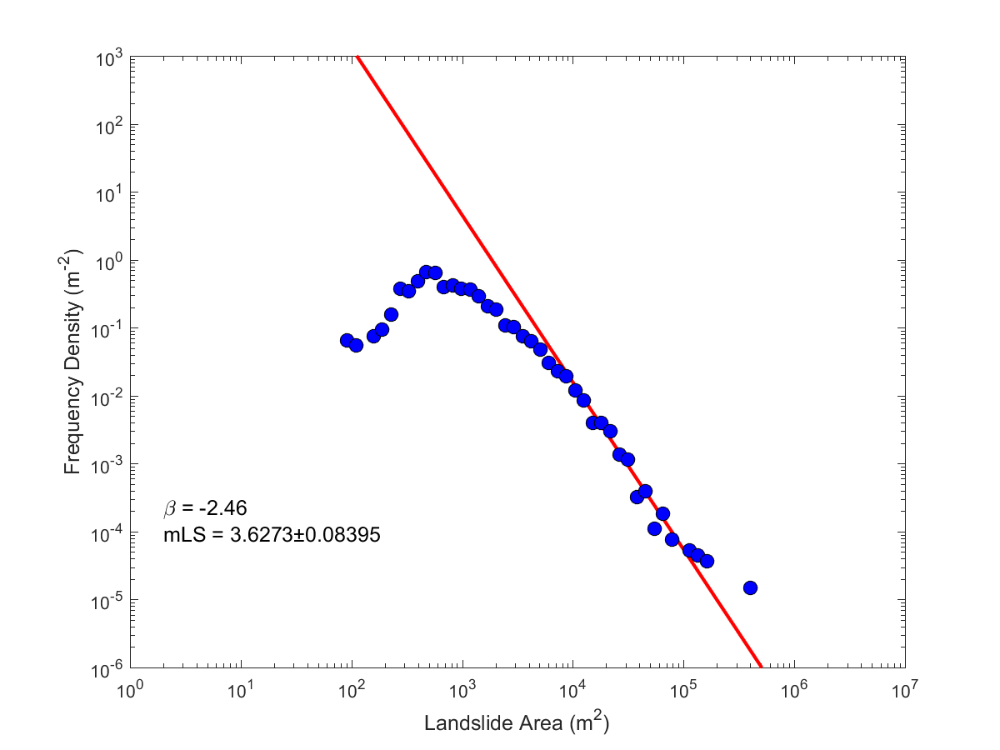

# mLS

## Introduction

mLS is a function that estimates the landslide magnitude (mLS) from cutoff 
(smallest area that follows power law), beta (power-law exponent), and an 
array of areas derived from a landslide inventory following the methods of 
Tanyas and others (in prep). It can also calculate the uncertainty in 
landslide-event magnitude if uncertainties in cutoff and beta values are 
given as input parameters. The function plots the best power-law fit for 
the medium and large landslides and the frequency-area distribution of the 
analyzed inventory. It also returns the corresponding mLS (landslide-event magnitude)
value.

To obtain the cutoff and beta values the method suggested by Clauset et al.(2009) 
can be used. The original scripts (plfit.m and plvar.m) of Clauset et al. (2009)
can be downloaded from the following link to calculate these parameters: 
http://www.santafe.edu/~aaronc/powerlaws/ 

### To install this function:

Download mLS.m and add it to your matlab path

## Usage example (from mLS.m)

```
% Upload the landslide areas, which you want to analyze their frequency-area 
% distribution, as a horizontal array. In this example, we use the sample_data.m
% file that you can find in the repository. When you open the sample_data.m
% file in the Matlab, you will see the landslide areas array with a parameter name
% of 'Area'. This is the only input we need to run this code. In addition to that
% you can also use the uncertainty in the estimated power-law parameters to calculate
% the uncertainty in mLS. To reach those uncertainty estimates you can open 
% the cutoff_error.m and beta_error.m files, and use them as an input of this function.
% Noted that this function can be run with or without considering the estimates of 
% uncertainties. 

% In the following lines, the bins are defined with an array. We took 2 as 
% the minimum bin size and we used increasing bin sizes. We increase the 
% bin widths while the landslide size increases, so that bin widths become
% approximately equal in logarithmic coordinates. To create a long array for 
% the bins we tentatively pick 120 for the size of x1 vector defined below.
x1(1,1)=2;
for i=2:120
    x1(1,i)=x1(1,i-1)*1.2;
end
x2=log10(x1);

Freq=histc(Area,x1); %Frequency values are calculated for each bin 
s=size(x1);
s=s(1,2);
internal=zeros(1,s);

for i=2:s
     internal(1,i)=x1(1,i)-x1(1,i-1);
end
internal(1,1)=min(x1);
FD=Freq./internal;

x1_rev = abs(x1-cutoff);    % the index of value that is closest to cutoff value is identified along the x1 array 
[indexMidpoint indexMidpoint] = min(x1_rev);

x=x1(indexMidpoint:end); % the x (size bines) array for the frequeny-size distribution is defined 
y=FD(indexMidpoint:end); % the y (frequency densities) array for the frequeny-size distribution is defined 

if beta>0           % beta value have to be negative
    beta=-1*beta;
end
beta_stored=beta;

constant=y(1,1)/cutoff^beta;     % The c constant is calculated along the power-low where x=cutoff
fit_y=constant*x1.^beta;        % Frequency-density values calculated for the defined power-law fit
fit_y_stored=fit_y;             

midx=10^((log10(max(Area))+(log10(cutoff)))/2);     % The x and y values at mid-point location is read along the power-law fit
midy=constant*midx^beta;

Refmidx=4.876599623713225e+04;    % X value for the mid point of the Northridge (reference point) inventory
Refmidy=8.364725347860417e-04;    % Y value for the mid point of the Northridge (reference point) inventory
ac=Refmidy/(11111*Refmidx^beta);  % the c' constant (as) is calculated here for the mid-point of 
                                  % the Northridge inventory as a reference point where mLS=log(11111) 
                             
mLS=log10((midy/(ac*midx^(beta)))); % mLS is calculated in this line
mLS_stored=mLS;

% Uncertainty in mLS will be calculated if the required inputs are given
% To do that Monte-Carlo simulation is run 10,000 times 

if exist('beta_error')==1 && exist('cutoff_error')==1  
    beta_interval_N=((beta+beta_error)-(beta-beta_error))/(499); %Number of elements to create an array including 500 uniformly distributed beta values is defined 
    beta_interval=(beta-beta_error):beta_interval_N:(beta+beta_error);  %An array including 500 uniformly distributed beta values is defined     

    cutoff_min=(cutoff-cutoff_error); 
        if cutoff_min<=0
             cutoff_min=2;
        else
             cutoff_min=cutoff_min;
        end
    cutoff_max=(cutoff+cutoff_error);
    cutoff_interval_N=((cutoff_max)-(cutoff_min))/(499);    %Number of elements to create an array including 500 uniformly distributed cutoff values is defined 
    cutoff_interval=(cutoff_min):cutoff_interval_N:(cutoff_max); %An array including 500 uniformly distributed cutoff values is defined   

    beta_mean=mean(beta_interval); %Mean of beta values is identified
    beta_std=std(beta_interval);    %Standard deviation of beta vaues is identified
    cutoff_mean=mean(cutoff_interval);  %Mean of cutoff values is identified
    cutoff_std=std(cutoff_interval);    %Standard deviation of cutoff values is identified
    
        for i=1:10000   %mLS values are calculated for randomly sampled beta and cutoff values below
            cutoff=normrnd(cutoff_mean,cutoff_std);
            beta=normrnd(beta_mean,beta_std);
            constant=y(1,1)/cutoff^beta;
            fit_y=constant*x1.^beta; 
            midx=10^((log10(max(Area))+(log10(cutoff)))/2);
            ac=Refmidy/(11111*Refmidx^beta);
            mLS_array(i,1)=log10((midy/(ac*midx^(beta))));
        end

    mLS_array=mLS_array(all(~isinf(mLS_array),2),:); % "Inf" cells are removed from the array  
    error=std(mLS_array(:));    %Uncertainty of mLS calcultated as a first standard deviation of mLS values
else
    disp('Uncertainty in mLS will not be calculated because the variable "cutoff_error" and "beta_error" is missing')
    error='?'
end

% A graph showing the frequency-area distribution of the given landslides 
% and the corresponding power-law fit are plotted.
loglog(x1,fit_y_stored,'-','LineWidth',2,'Color','r');hold on
loglog(x1,FD,'ok','MarkerSize',8,'MarkerFaceColor','b','MarkerEdgeColor','k')
axis([1 1.E+7 1.E-6 1000])
set(get(gca,'Xlabel'),'string','Landslide Area (m^2)','FontSize',12, 'FontUnits','points','FontWeight','normal')
set(get(gca,'Ylabel'),'string','Frequency Density (m^-^2)','FontSize',12, 'FontUnits','points','FontWeight','normal')
str={['\beta = ',num2str(beta_stored)];['mLS = ',num2str(mLS_stored),(char(177)),num2str(error)]};
text(x1(1,1),(min(FD(FD>0)*10)),str,'FontSize',12) 

% For the given sample data, the corresponding beta (power-law exponent), 
% and mLS (landslide magnitude) values should be appeared as 
% -2.46, and 3.63±0.08 respectively. A plot showing the frequency-area distribution 
% of the given landslides and the corresponding power-law fit is also output, see image below.
```



## References

Clauset, A., Shalizi, C.R. and Newman, M.E., 2009. Power-law distributions in empirical data. SIAM review, 51(4): 661-703. DOI:10.1137/070710111

Guzzetti, F., Malamud, B.D., Turcotte, D.L. and Reichenbach, P., 2002. Power-law correlations of landslide areas in central Italy. Earth and Planetary Science Letters, 195(3): 169-183. DOI:10.1016/S0012-821X(01)00589-1

Stark, C.P. and Guzzetti, F., 2009. Landslide rupture and the probability distribution of mobilized debris volumes. Journal of Geophysical Research: Earth Surface, 114(F2). DOI:10.1029/2008JF001008

Tanyas, H., Allstadt, K.E., and van Westen, C.J. (in press). An updated method for estimating landslide-event magnitude. Earth Surface Processes and Landforms.

Van Den Eeckhaut, M., Poesen, J., Govers, G., Verstraeten, G. and Demoulin, A., 2007. Characteristics of the size distribution of recent and historical landslides in a populated hilly region. Earth and Planetary Science Letters, 256(3): 588-603. DOI:10.1016/j.epsl.2007.01.040
